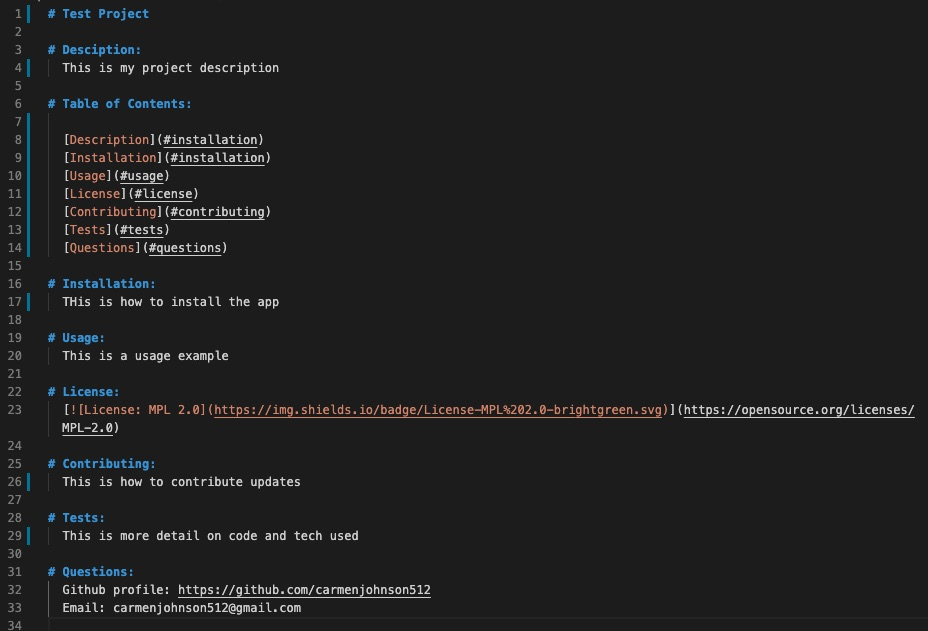

# Carmen Johnson | README Generator

Email: carmenjohnson512@gmail.com | LinkedIn: https://www.linkedin.com/in/carmenjohnson512/

## Project Overview

A command-line application that dynamically generates a professional README.md from a user's input using the [Inquirer package](https://www.npmjs.com/package/inquirer). The application is invoked with the following command:

```
node index.js
```

## App Example


## Sample Output


